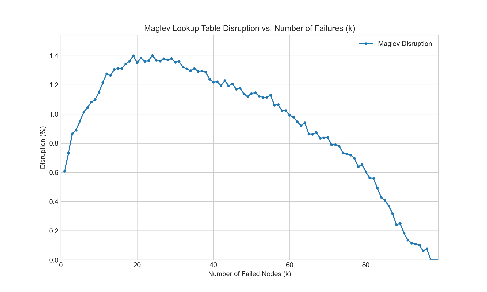

# Maglev Hash - C Implementation

This directory contains the C language implementation of Google's Maglev consistent hashing algorithm. This version focuses on performance and manual memory management.

## Components

- **`maglev.h`**: The header file defining the public API for the Maglev library.
- **`maglev.c`**: The core C implementation of the Maglev hash.
- **`test_maglev.c`**: A program with unit tests for the core library.
- **`demo.c`**: A simple demonstration program showing how to use the Maglev library.
- **`experiment.c`**: A program to reproduce the k-failure disruption experiment from the Maglev paper.
- **`Makefile`**: The makefile to build and run all C components.
- **`plot.py`**: A Python script to visualize the experiment results from `results.csv`.
- **`requirements.txt`**: Python dependencies needed for the plotting script.

## How to Run

All commands should be run from this directory (`c/`).

### Compile the Library

To compile the `maglev.o` object file:

```bash
make all
```
or simply:
```bash
make
```

### Run the Tests

To compile and run the unit tests:

```bash
make test
```

### Run the Demo

To compile and run the demonstration program:

```bash
make run-demo
```

This will initialize a Maglev table, show how keys are mapped, and print the lookup table distribution.

### Run the k-Failure Experiment

You can reproduce the k-failure experiment from the paper.

**1. Run the experiment:**

The `Makefile` handles compiling and running the C program. It saves the output to `results.csv`.

```bash
make run-experiment
```

**2. Plot the results:**

This project includes a Python script to plot the results. It's recommended to use a virtual environment.

```bash
# Create a virtual environment (only needs to be done once)
python3 -m venv venv

# Activate the virtual environment and install dependencies
source venv/bin/activate
pip install -r requirements.txt

# Run the plotting script
python3 plot.py
```

This will generate an image file named `k_failure_disruption.png`.

## Experiment Results

The plot below shows the percentage of lookup table entries that were re-mapped to a *different, non-failed* backend when `k` backends are removed. The results are nearly identical to the Go implementation and align with the paper's findings, showing Maglev's excellent stability.


