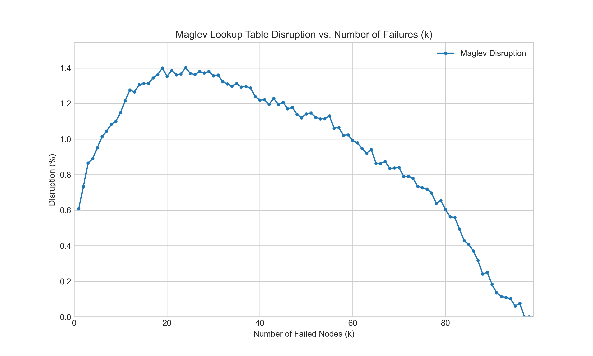

# Maglev Hash - Go Implementation

This directory contains the Go language implementation of Google's Maglev consistent hashing algorithm.

## Components

- **`maglev.go`**: The core library implementation of the Maglev hash.
- **`maglev_test.go`**: Unit and benchmark tests for the core library.
- **`cmd/demo/main.go`**: A simple demonstration program showing how to use the `maglev` package.
- **`cmd/experiment/main.go`**: A program to reproduce the k-failure disruption experiment from the Maglev paper.
- **`run_experiment.sh`**: A script to run the experiment and save the results to `results.csv`.
- **`plot.py`**: A Python script to visualize the experiment results from `results.csv`.
- **`requirements.txt`**: Python dependencies needed for the plotting script.

## How to Run

### Run the Demo

To see a simple demonstration of the Maglev algorithm, run the following command from this directory (`go/`):

```bash
go run ./cmd/demo
```

This will initialize a Maglev table with a few backends, show how keys are mapped, and print the distribution of lookup table entries.

### Run the k-Failure Experiment

The Maglev paper includes an experiment that measures the disruption to the lookup table when `k` backends fail. You can reproduce this experiment here.

**1. Run the experiment script:**

This script executes the Go program to simulate failures and saves the output to `results.csv`. From the `go/` directory, run:

```bash
./run_experiment.sh
```

**2. Plot the results:**

This project includes a Python script to plot the results. It's recommended to use a virtual environment. From the `go/` directory, run:

```bash
# Create a virtual environment (only needs to be done once)
python3 -m venv venv

# Activate the virtual environment and install dependencies
source venv/bin/activate
pip install -r requirements.txt

# Run the plotting script
python3 plot.py
```

This will generate an image file named `k_failure_disruption.png`.

## Experiment Results

The plot below shows the percentage of lookup table entries that were re-mapped to a *different, non-failed* backend when `k` backends are removed. The results align with the paper's findings: Maglev provides excellent stability, with minimal disruption for the remaining healthy backends.


